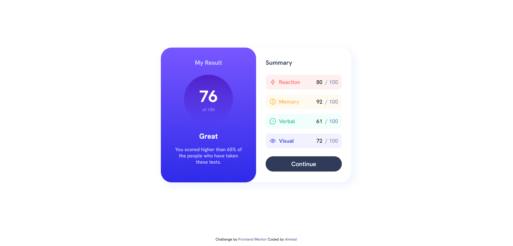
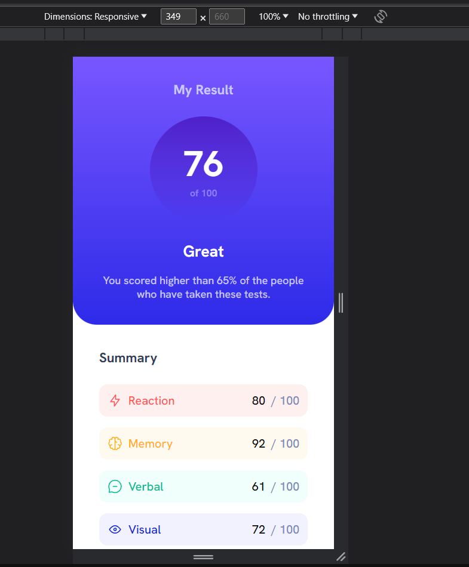

# Results Summary Component 👨‍💻

## Table of Contents 📋
- [Project Overview](#project-overview) 🌟
- [Technologies Used](#technologies-used) 💻
- [Features](#features) ✨
- [Screenshots](#screenshots) 📷

## Project Overview 🌟
This project is a coding challenge completed as a part of Frontend Mentor. The challenge is to build a results summary component and make it look as close to the provided design as possible.

## Technologies Used 💻
- HTML
- CSS

## Features ✨
- Responsive design for both mobile and desktop screens.
- Hover and focus states for interactive elements.

## Screenshots 📷

